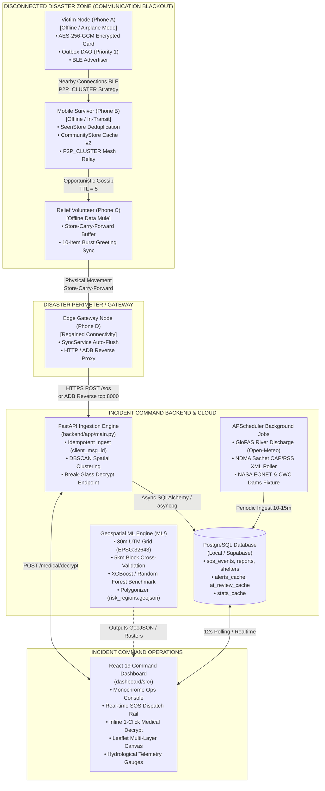
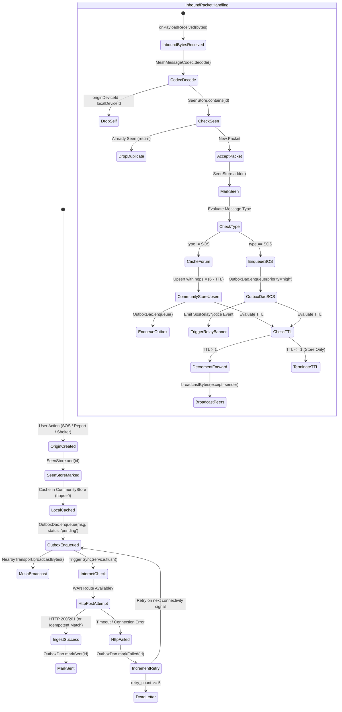
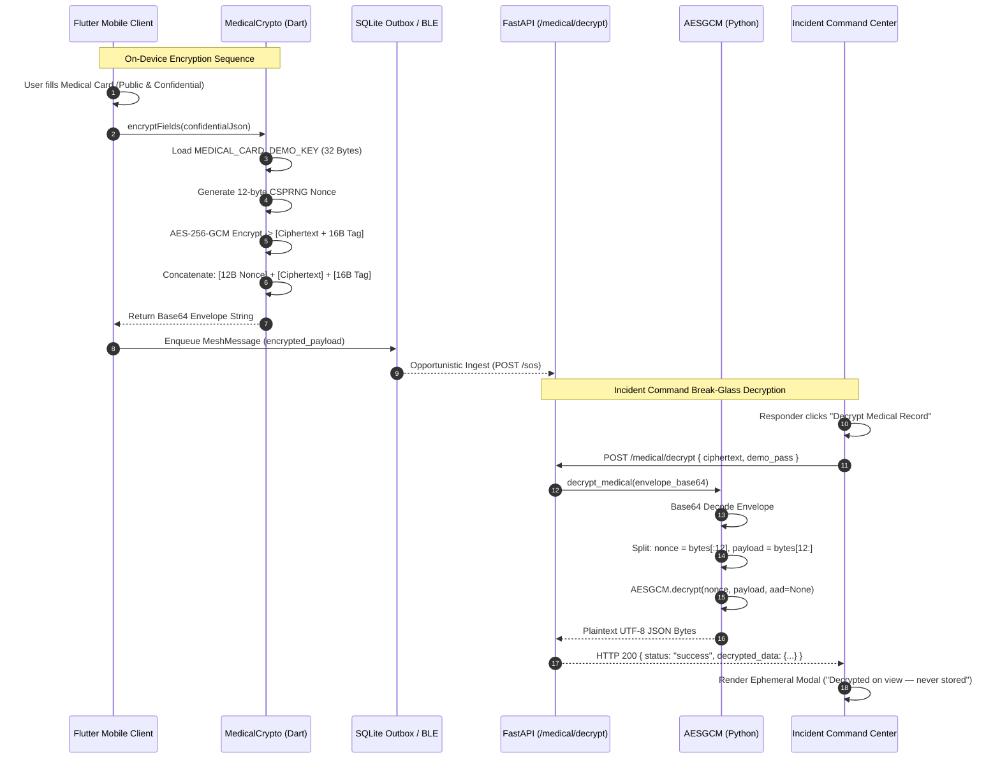

# RELINK: Distributed Systems Architecture & Technical Reference Manual
### High-Assurance, Delay-Tolerant Disaster Resilience Platform for Communication-Blackout Environments

---

## Executive Summary & System Overview

**RELINK** is a life-safety distributed computing and communication platform engineered specifically for total infrastructure failure environments resulting from catastrophic natural hazards (e.g., severe tropical cyclones, extreme monsoon flooding, and massive hill-tract landslides). 

In disaster scenarios such as the 2018/2019 Kerala floods or the 2024 Wayanad landslide disasters, physical telecommunications backhauls (fiber lines, cellular base stations, and electrical substations) are severed within minutes. Commercial mobile applications that depend on cloud gateways and persistent Internet access immediately fail, leaving trapped populations invisible to disaster management authorities.

RELINK solves this existential vulnerability through a multi-tier, delay-tolerant architecture:
1. **At the Disconnected Edge (`mobile/`)**: An offline-first Flutter client creates an autonomous peer-to-peer (P2P) opportunistic mesh network via Google Nearby Connections (using Bluetooth Low Energy 5.0 and Wi-Fi Direct under the `P2P_CLUSTER` topology). Devices exchange high-priority distress beacons (carrying AES-256-GCM encrypted medical records), crowdsourced hazard reports, missing-person inquiries, and relief shelter locations over an opportunistic store-carry-forward gossip protocol without cellular coverage.
2. **At the Gateway & Ingestion Layer (`backend/`)**: As mobile nodes traverse the disaster perimeter and reach opportunistic connectivity (e.g., satellite links, mobile mesh gateways, or ADB reverse proxy bridges), an asynchronous FastAPI ingestion engine accepts batches of relayed packets. The backend guarantees idempotent ingestion via client-assigned UUID uniqueness constraints, collapses duplicate spatial hazard reports using a density-based clustering algorithm (scikit-learn DBSCAN with Haversine great-circle distance), and continuously aggregates real-time environmental telemetry (GloFAS river discharge, NDMA Sachet CAP/RSS alerts, IMD weather, and CWC dam levels) via APScheduler background workers.
3. **At the Incident Command Center (`dashboard/`)**: A React 19 + Vite + Tailwind CSS v4 responder operations dashboard renders a unified operational picture over Leaflet GIS canvas. Responders receive real-time SOS feeds, inspect DBSCAN hazard clusters, monitor upstream hydrological hydrographs, and execute break-glass ephemeral client-side decryption of confidential medical dossiers without storing unencrypted medical data on the server.
4. **At the Geospatial Intelligence Core (`ML/`)**: An autonomous geospatial machine learning engine standardizes satellite and terrain data across a 30-meter UTM Zone 43N grid (EPSG:32643), runs spatial block cross-validation (5 km blocks) to eliminate spatial autocorrelation data leakage, benchmarks competing predictive models (Logistic Regression, Random Forest, XGBoost), and polygonizes high-risk susceptibility zones into standard GeoJSON features (`risk_regions.geojson`).

---

## 1. System Vision, Personas & Operating Modes

### 1.1 Dual-Persona Architecture

A fundamental operational error in traditional emergency apps is assuming uniform device behavior across all users. RELINK enforces an architectural separation between two distinct survivor archetypes:

```
+---------------------------------------------------------------------------------------+
|                                 RELINK PERSONA MATRIX                                 |
+------------------------------------+--------------------------------------------------+
| TRAINED / ISOLATED VICTIM          | DISPLACED / MOBILE SURVIVOR                      |
+------------------------------------+--------------------------------------------------+
| • Trapped in attic, rooftop, debris| • Evacuated or moving through disaster zone     |
| • Extremely constrained battery     | • Rechargeable at camp, vehicle, or solar bank   |
| • Primary Need: Immediate Rescue   | • Primary Need: Coordinate, report, search       |
| • Radio: Triggered Burst Only      | • Radio: Continuous Mesh Relay & Sync Node       |
| • Beacon: AES-GCM Encrypted Card   | • Local Cache: Full Community Bulletin Store    |
+------------------------------------+--------------------------------------------------+
```

#### The Isolated / Trapped Victim
- **Operational Reality**: The device may be running on critical battery (<15%) with the user physically incapacitated or pinned. Continuous RF transmission (BLE advertising and scanning) depletes lithium-ion batteries rapidly.
- **Protocol Enforcement**: The radio interface remains strictly quiet until the user actuates the high-priority SOS sequence. Upon trigger, the device issues a high-priority beacon burst containing GPS coordinates, public triage markers, and an AES-256-GCM encrypted medical payload. Scanning intervals are aggressively throttled to preserve power for periodic acoustic/BLE localization.

#### The Displaced / Mobile Survivor
- **Operational Reality**: Walking between relief camps, distribution points, or unflooded roads, often carrying a device with intermittent access to power generators.
- **Protocol Enforcement**: Acts as an active physical "data mule" in the Delay-Tolerant Network (DTN). The device advertises and discovers peers concurrently, greets joining nodes with a 10-item community bulletin burst sync, buffers relayed SOS packets from trapped victims, and carries them across physical space until crossing into a network-connected zone.

---

### 1.2 Network Operating Regimes

RELINK operates across three distinct operational network regimes, transitioning automatically without application restarts or user intervention:

```
+---------------------------------------------------------------------------------------+
|                              NETWORK OPERATING REGIMES                                |
+-----------------------+-------------------------------+-------------------------------+
| REGIME 1: OFFLINE     | REGIME 2: INTERMITTENT        | REGIME 3: CONNECTED GATEWAY   |
| (AIRPLANE MODE + BLE) | (PARTITIONED / EDGE)          | (CLOUD / SATELLITE / ADB)     |
+-----------------------+-------------------------------+-------------------------------+
| • Cellular: OFF       | • Cellular: Sporadic 2G/3G    | • Cellular: Stable 4G/5G      |
| • Wi-Fi WAN: OFF      | • Wi-Fi WAN: Fleeting Edge    | • Wi-Fi WAN: Operational      |
| • Bluetooth: ON       | • P2P Mesh: Fully Active      | • Mesh: Ingesting & Uploading |
| • Transport: P2P Mesh | • DTN Queue: Accumulating     | • DTN Queue: Auto-Flushing    |
| • Store: Local SQLite | • Sync: Opportunistic Tries   | • Telemetry: Real-time Ingest |
+-----------------------+-------------------------------+-------------------------------+
```

1. **Regime 1: Fully Offline (Blackout / Airplane Mode + BLE)**
   - No Internet gateway exists within radio range.
   - All messages originate and propagate strictly over Nearby Connections BLE/Wi-Fi Direct.
   - Local state is written to SQLite (`outbox`, `seen_ids`, `community_items`).
   - The UI renders map layers and forum bulletins entirely from local SQLite tables.
2. **Regime 2: Intermittent / Partitioned Network**
   - Packets travel through multi-hop mesh relays across islanded survivor pockets.
   - Nodes periodically test HTTP WAN health (`GET /health`). 
   - When brief cellular bursts appear, the background `SyncService` attempts to drain the pending queue. Failed requests are safely held in SQLite without packet loss.
3. **Regime 3: Connected Cloud Gateway**
   - A node establishes a reliable uplink (Starlink terminal, operational cellular tower, or field command ADB reverse tether).
   - The node immediately flushes its accumulated outbox queue to the FastAPI backend via `POST /sos` and `POST /reports`.
   - The gateway receives incoming NDMA Sachet emergency alerts and broadcasts them *backward* into the offline mesh.

---

### 1.3 Aesthetic & Human Factors: "Calm Humanitarian" Design Specification

In high-stress disaster environments, cognitive overload and sensory panic can induce fatal survivor errors or responder paralysis. RELINK rejects aggressive "tactical military" aesthetics in favor of the **Calm Humanitarian** design philosophy:

* **The Alarm-Red Reservation Rule**: The color alarm-red (`#FF0000` / `#EF4444`) is **strictly reserved** for two states only:
  1. The primary SOS activation button and its active broadcast confirmation state.
  2. Official NDMA "Red" extreme disaster warning banners and dams exceeding critical danger capacity (>90%).
  *No other UI element, standard action button, form error, or navigation tab may utilize pure red.* Normal alerts use amber/orange, shelters use soft teal, and missing persons use muted violet.
* **Typography & Hierarchy**: Inter / Nunito rounded typography with generous line heights (1.5–1.6). Body copy avoids all-caps yelling. Official government warnings (NDMA Sachet) are quoted verbatim in dedicated monospace/quote containers to prevent misinformation or paraphrasing errors.
* **Psychological Safety & Reassurance**: When an offline user submits a report or triggers an SOS, the system provides immediate, calm confirmation: `"Saved to offline queue — broadcasting to nearby devices"`. The app bar features a live peer radar pill (`🟢 2 Peers Nearby`) to reassure the user that their device is physically linked to a local network of human survivors.

---

## 2. End-to-End System Topology & Protocols

### 2.1 Complete Architectural Topology

The diagram below illustrates the end-to-end data pipeline from an isolated victim phone to the incident command center:



---

### 2.2 Mesh Message Wire Protocol

Every packet traversing the RELINK mesh conforms to a strict, typed wire specification encoded in UTF-8 JSON. Payloads are bounded to a maximum size of 32 KB (`MeshMessageCodec.maxPayloadBytes = 32 * 1024`) to eliminate BLE buffer saturation on low-memory Android hardware.

#### Wire Schema Contract

```json
{
  "id": "c4b8e21a-9f12-4e89-8d76-1b4e5a90d812",
  "type": "SOS",
  "origin_device_id": "fd362824-78bc-4321-90ab-cde012345678",
  "ttl": 6,
  "priority": "high",
  "timestamp": "2026-09-06T03:30:00.000Z",
  "payload": {
    "lat": 9.9312,
    "lng": 76.2673,
    "plaintext_medical": {
      "name": "Rahul Nair",
      "blood_group": "O+",
      "allergies": ["Penicillin"],
      "emergency_contact": {
        "name": "Priya Nair",
        "phone": "+919847012345"
      }
    }
  },
  "encrypted_payload": "MTIzNDU2Nzg5MGFiih5UBr/B5OwTvwfWmewx7HRSEbpkeLxM53YC2EzAStlJf10/IvzWEybVb0gXMIKAkfXLVLMxN4xb5IDEDozPAFyHv9Oc0c5VrYVDENFCMi04Mz8YoEVP8I1Ln5KFK58vwDWzQGaK/+6KM3FnNDTbBgjwHsg54BfJqcwCR2ZXpcuv79WVDnv/BptMNuGo1XW3wjc1c4mPeQVwCgiZPfkTlMkiISJPaZHo7uAuntYY3aR5qSVcV5kOueaWjwI4XAtD1zlO"
}
```

#### Message Type Schemas & Payloads

```
+------------------+----------+---------------------------------------------------------+
| MESSAGE TYPE     | PRIORITY | PRIMARY PAYLOAD FIELDS                                  |
+------------------+----------+---------------------------------------------------------+
| SOS              | high     | lat, lng, plaintext_medical, [encrypted_payload]        |
| REPORT           | normal   | type (obstacle|disease|water), lat, lng, description     |
| MISSING_PERSON   | normal   | name, last_seen_lat, last_seen_lng, description         |
| SHELTER          | normal   | name, lat, lng, contact_info                            |
+------------------+----------+---------------------------------------------------------+
```

1. **SOS Payload (`type: "SOS"`)**:
   ```json
   {
     "lat": 9.9312,
     "lng": 76.2673,
     "plaintext_medical": {
       "name": "Rahul Nair",
       "blood_group": "O+",
       "allergies": ["Penicillin"],
       "emergency_contact": { "name": "Priya Nair", "phone": "+919847012345" }
     }
   }
   ```
2. **Hazard Report Payload (`type: "REPORT"`)**:
   ```json
   {
     "type": "obstacle",
     "lat": 9.9815,
     "lng": 76.2840,
     "description": "Periyar bridge approach road submerged under 1.5m rapid floodwater."
   }
   ```
3. **Missing Person Payload (`type: "MISSING_PERSON"`)**:
   ```json
   {
     "name": "Ananya Kumar",
     "last_seen_lat": 9.9720,
     "last_seen_lng": 76.2790,
     "description": "Age 12, red raincoat, last seen near Aluva railway overbridge."
   }
   ```
4. **Relief Shelter Payload (`type: "SHELTER"`)**:
   ```json
   {
     "name": "St. Mary's Higher Secondary School Camp",
     "lat": 9.9950,
     "lng": 76.3020,
     "contact_info": "Camp Officer: Fr. George (+919447112233)"
   }
   ```

---

### 2.3 Flooding & Gossip Protocol Algorithms

RELINK avoids the overhead of establishing complex routing trees or maintaining reactive AODV/DSR routing tables, which collapse in dynamic disaster topologies. Instead, it utilizes a constrained, deduplicated epidemic gossip flooding algorithm.

#### 1. Deduplication via `SeenStore` (24-Hour Sliding Window)
Every node maintains a local table `seen_ids` within SQLite. When a raw byte sequence arrives:
1. `MeshMessageCodec.decode(bytes)` deserializes the packet.
2. If `msg.originDeviceId == localDeviceId`, it is dropped immediately (self-reflection prevention).
3. The message UUID is checked against `seen_ids` via `SeenStore.contains(msg.id)`. If present, the packet is discarded without relaying.
4. If novel, `SeenStore.add(msg.id)` registers the UUID with a UTC timestamp.
5. Periodic maintenance invokes `SeenStore.sweep()`, deleting records older than 24 hours (`seen_at < datetime('now', '-24 hours')`) to prevent boundless database expansion.

#### 2. Outbox Queue Priority Drain Ordering
Packets needing cloud synchronization are stored in SQLite `outbox`. The drain query is strictly prioritized:
```sql
SELECT payload FROM outbox 
WHERE status IN ('pending', 'failed')
ORDER BY priority = 'high' DESC, created_at ASC
LIMIT 50;
```
*Rationale*: SOS distress beacons (`priority: 'high'`) preemptively jump ahead of community forum posts (`priority: 'normal'`). `created_at` records the original message generation timestamp rather than the SQLite insertion timestamp, preserving true chronological causality across multi-hop relays.

#### 3. Peer Greeting Burst-Sync Protocol
When two devices discover each other and complete a Nearby Connections handshake (`onPeerConnected`), an automated greeting sync fires:
1. The listening device invokes `_burstSyncTo(endpointId)`.
2. The node queries `CommunityStore.recentMessages(limit: 10)` to retrieve the 10 most recent bulletins (hazards, missing persons, shelters).
3. The node transmits these 10 packets sequentially to the new peer.
4. *Result*: A displaced survivor entering an isolated valley immediately receives the local hazard picture without touching a single button.

#### 4. Dead-Letter Handling & Exponential Backoff
When `SyncService` attempts to flush the queue to the backend:
- Network errors (socket timeout, connection refused) leave the record in `failed` status to retry upon next reconnect.
- Client validation errors (HTTP 400/422) increment `retry_count`.
- When `retry_count >= 5`, the message is dead-lettered (`status = 'dead_letter'`). This prevents malformed payloads from permanently blocking the outbox queue while preserving forensic telemetry.

---

### 2.4 Delay-Tolerant Network (DTN) State Machine

The complete lifecycle of a RELINK mesh packet through storage, transmission, and synchronization is modeled below:



---

## 3. Cryptographic Security & Medical Records

### 3.1 Dual-Zone Medical Record Architecture

Field triage personnel operate in high-casualty, zero-trust, communication-blackout environments. If an entire medical record is encrypted, field responders cannot view the victim's blood type or severe drug allergies without an authorized cryptographic key. If the record is unencrypted, the victim's constitutional privacy rights regarding chronic conditions, psychiatric history, and insurance policies are compromised across thousands of civilian relay nodes.

RELINK implements an immutable **Dual-Zone Medical Record Contract**:

```
+---------------------------------------------------------------------------------------+
|                        DUAL-ZONE MEDICAL RECORD ARCHITECTURE                          |
+---------------------------------------------------------------------------------------+
|  ZONE 1: PLAINTEXT PUBLIC ZONE (BROADCAST OPENLY IN SOS PAYLOAD)                      |
|  • Full Legal Name                     (e.g., "Rahul Nair")                           |
|  • Blood Group                         (e.g., "O+")                                   |
|  • Severe / Critical Allergies         (e.g., ["Penicillin", "Sulfa"])                |
|  • Primary Emergency Contact           (e.g., "Priya Nair (+919847012345)")           |
|  --> Purpose: Instant field triage by any volunteer responder without decryption.      |
+---------------------------------------------------------------------------------------+
|  ZONE 2: ENCRYPTED CONFIDENTIAL ZONE (BASE64 AES-256-GCM IN ENCRYPTED_PAYLOAD)        |
|  • Pre-existing Chronic Conditions     (e.g., "Severe Asthma, Type-2 Diabetes")       |
|  • Ongoing Critical Medications        (e.g., "Salbutamol Inhaler, Metformin 500mg")   |
|  • Medical Insurance Provider          (e.g., "Star Health & Allied Insurance")       |
|  • Policy Identification Number        (e.g., "P/161130/01/2024/000001")              |
|  --> Purpose: Gated exclusively to Incident Command physicians via break-glass keys.  |
+---------------------------------------------------------------------------------------+
```

---

### 3.2 Cryptographic Primitive & Wire Layout

Sensitive fields are encrypted client-side in Dart using the `cryptography` package prior to entering the mesh outbox.
* **Algorithm**: Symmetric AES-256-GCM (`AesGcm.with256bits()`).
* **Authenticated Encryption**: Provides both confidentiality and authenticated integrity. Any tampering with the ciphertext by an intermediate mesh relay causes authentication tag verification to fail during decryption.
* **Nonce Specification**: 96-bit (12-byte) cryptographically secure random nonce (`_algo.newNonce()`), regenerated on every single encryption invocation. Nonces are never reused under the same key.
* **Tag Specification**: 128-bit (16-byte) Galois authentication tag.
* **Wire Format**: Dart's `SecretBox.concatenation()` layout serialized into standard Base64:

$$\text{Wire Envelope} = \text{Base64}\Big( \underbrace{\text{Nonce}}_{\text{12 Bytes}} \;\mathbin{\Vert}\; \underbrace{\text{Ciphertext}}_{N \text{ Bytes}} \;\mathbin{\Vert}\; \underbrace{\text{Authentication Tag}}_{\text{16 Bytes}} \Big)$$

---

### 3.3 Key Management & Decryption Workflow

1. **Pre-Shared Deployment Key**: In disaster operations, complex PKI key exchanges or asymmetric RSA/ECC handshakes fail due to unreachable certificate authorities. RELINK uses a pre-shared 256-bit symmetric deployment key (`MEDICAL_CARD_DEMO_KEY`), injected during compilation:
   ```bash
   flutter run --dart-define=MEDICAL_CARD_DEMO_KEY=AvhVqE/lK/Jv/o5kalpkYjBKHJSxolRrw9j52m1qqCQ=
   ```
2. **Graceful Degradation Contract**: If the client lacks `MEDICAL_CARD_DEMO_KEY` (or the key is malformed), `MedicalDemoKey.load()` returns `null`. **The emergency beacon is never blocked.** The app logs a diagnostic warning and sends the SOS without an encrypted payload. A distress call must never be suppressed due to a crypto failure.
3. **Break-Glass Ingestion API (`POST /medical/decrypt`)**:
   - Responders at Incident Command trigger decryption via the backend endpoint implemented in `backend/app/routers/medical.py`.
   - The endpoint checks demo authentication (`demo_pass == DECRYPT_DEMO_PASS`), decodes the Base64 string, strips the 12-byte nonce, and invokes Python's `cryptography.hazmat.primitives.ciphers.aead.AESGCM.decrypt()`.
4. **Dashboard Ephemeral Guarantee**: Decrypted confidential records are held in React state memory only while the `DecryptModal` is open. They are never written to localStorage, IndexedDB, or database disks. The modal displays an explicit legal indicator: `"Decrypted on view — Confidential — never stored"`.

---

### 3.4 Cross-Language Verification & Golden Vector

To guarantee byte-level interoperability between Dart (`cryptography` v2.7) on Android and Python (`cryptography` v43+) on the FastAPI backend, the repository maintains an automated golden-vector test contract located at `backend/tests/golden_vector.json`:

```json
{
  "comment": "Golden cross-language vector. Dart AesGcm.with256bits SecretBox.concatenation() == base64([12B nonce][ciphertext][16B tag]). Python AESGCM must decrypt to expected.",
  "key_base64": "AvhVqE/lK/Jv/o5kalpkYjBKHJSxolRrw9j52m1qqCQ=",
  "nonce_base64": "MTIzNDU2Nzg5MGFi",
  "ciphertext_base64": "MTIzNDU2Nzg5MGFiih5UBr/B5OwTvwfWmewx7HRSEbpkeLxM53YC2EzAStlJf10/IvzWEybVb0gXMIKAkfXLVLMxN4xb5IDEDozPAFyHv9Oc0c5VrYVDENFCMi04Mz8YoEVP8I1Ln5KFK58vwDWzQGaK/+6KM3FnNDTbBgjwHsg54BfJqcwCR2ZXpcuv79WVDnv/BptMNuGo1XW3wjc1c4mPeQVwCgiZPfkTlMkiISJPaZHo7uAuntYY3aR5qSVcV5kOueaWjwI4XAtD1zlO",
  "expected": {
    "conditions": "Asthma, Type-2 Diabetes",
    "medications": "Salbutamol inhaler, Metformin 500mg",
    "insurance_provider": "Star Health",
    "insurance_policy_number": "P/161130/01/2024/000001"
  }
}
```

#### Cryptographic Sequence Diagram



---

## 4. Mobile Client Architecture (`mobile/`)

### 4.1 Subsystem Directory Layout

The mobile client is built on Flutter 3.47+ (Dart 3.6+) targetting Android API 24 through 34+.

```
mobile/lib/
|-- crypto/
|   |-- demo_key.dart             # Pre-shared 32-byte key loader via --dart-define
|   +-- medical_crypto.dart       # AES-256-GCM SecretBox concatenation & decryption
|-- mesh/
|   |-- mesh_manager.dart         # Core DTN engine, SeenStore integration, burst sync
|   |-- mesh_message_codec.dart   # JSON serializer/deserializer with 32KB payload guard
|   |-- nearby_transport.dart     # Google Nearby Connections wrapper (P2P_CLUSTER)
|   +-- seen_store.dart           # 24-hour sliding window deduplication store (SQLite)
|-- models/
|   |-- community_item.dart       # Local community forum domain model (hops, origin)
|   +-- mesh_message.dart         # Canonical wire format (id, type, ttl, priority)
|-- screens/
|   |-- alerts/alerts_screen.dart # NDMA Sachet verbatim alert feed & severity badges
|   |-- map/map_screen.dart       # flutter_map OSM canvas, layer toggling, pin nudge
|   |-- sos/sos_screen.dart       # Distress confirmation, medical card input, status
|   |-- stats/stats_screen.dart   # Hydrological hydrograph, rainfall gauge, dams list
|   +-- submit/submit_hub.dart    # Hazard report, shelter, and missing person forms
|-- services/
|   |-- alert_poller.dart         # Background/foreground polling for Sachet alerts
|   |-- api_client.dart           # HTTP transport to FastAPI backend
|   |-- notification_service.dart # Local heads-up emergency notification channel
|   +-- sync_service.dart         # Store-carry-forward outbox drain & HTTP gateway
+-- storage/
    |-- community_store.dart      # Local SQLite cache for offline bulletins
    |-- database.dart             # SQLite database migrations (Schema v1 -> v2)
    +-- outbox_dao.dart           # Priority queue DAO (priority=high DESC, created_at ASC)
```

---

### 4.2 Mesh Transport Implementation & Radio Discipline

The mobile mesh layer is implemented in `mobile/lib/mesh/nearby_transport.dart` utilizing the native Google Nearby Connections API plugin:
- **Topology Strategy**: `Strategy.P2P_CLUSTER`. This enables an $M$-to-$N$ ad-hoc star-like mesh topology where every phone simultaneously advertises and discovers peers without requiring a centralized Wi-Fi access point or cellular mast.
- **Service Identifier**: `in.relink.mesh`.
- **Collision Tie-Breaker**: When Phone A and Phone B discover each other at the identical millisecond, both devices would traditionally attempt connection, causing immediate race conditions and radio state failure. RELINK resolves this deterministically:
  ```dart
  if (localDeviceId.compareTo(endpointName) < 0) {
    _nearby.requestConnection(localDeviceId, endpointId, ...);
  } else {
    _log('Awaiting connection request from $endpointName (tie-breaker)...');
  }
  ```
  Only the device with the lexicographically smaller device ID initiates the connection request; the other device transitions to listening mode.

#### Android Manifest Requirements & Permissions (`AndroidManifest.xml`)
To enable autonomous background BLE discovery and unhindered localhost gateway communication, the Android manifest declares:
```xml
<!-- Bluetooth Low Energy 5.0 (Android 12+ API 31+) -->
<uses-permission android:name="android.permission.BLUETOOTH_SCAN"
                 android:usesPermissionFlags="neverForLocation" />
<uses-permission android:name="android.permission.BLUETOOTH_ADVERTISE" />
<uses-permission android:name="android.permission.BLUETOOTH_CONNECT" />

<!-- Nearby Wi-Fi Devices (Android 13+ API 33+) -->
<uses-permission android:name="android.permission.NEARBY_WIFI_DEVICES"
                 android:usesPermissionFlags="neverForLocation" />

<!-- Precise GPS for Hazard Pin Nudging -->
<uses-permission android:name="android.permission.ACCESS_FINE_LOCATION" />
<uses-permission android:name="android.permission.ACCESS_COARSE_LOCATION" />

<!-- High-Priority OS Notification Channels -->
<uses-permission android:name="android.permission.POST_NOTIFICATIONS" />
<uses-permission android:name="android.permission.USE_FULL_SCREEN_INTENT" />

<!-- Gateway Connectivity Support -->
<application android:usesCleartextTraffic="true" ... />
```

#### `MeshTransportApi` Testing Abstraction
Physical BLE radios cannot be virtualized inside CI/CD pipelines or standard headless unit tests. RELINK abstracts the transport layer into `MeshTransportApi`:
```dart
abstract class MeshTransportApi implements Listenable {
  MeshTransportStatus get status;
  int get peerCount;
  List<String> get eventLog;
  Future<void> Function(String endpointId, Uint8List bytes)? onPayloadReceived;
  void Function(PeerInfo peer)? onPeerConnected;
  void Function(String endpointId)? onPeerDisconnected;

  Future<bool> start();
  Future<void> stop();
  Future<int> broadcastBytes(Uint8List bytes, {String? exceptEndpointId});
  Future<void> sendToEndpoint(String endpointId, Uint8List bytes);
}
```
This enables `FakeTransport` to drive `MeshManager` in unit tests, verifying complex multi-hop flooding, deduplication, and outbox prioritization without physical hardware.

---

### 4.3 Local Storage Architecture (`sqflite`)

All local state is persisted in an embedded SQLite database (`relink.db`, schema version 2).

#### Database DDL Specification (`mobile/lib/storage/database.dart`)

```sql
-- Delay-tolerant outbox queue for cloud synchronization
CREATE TABLE outbox (
  id TEXT PRIMARY KEY,
  type TEXT NOT NULL,
  priority TEXT NOT NULL,
  ttl INTEGER NOT NULL,
  payload TEXT NOT NULL,
  status TEXT NOT NULL DEFAULT 'pending', -- 'pending' | 'sending' | 'sent' | 'failed'
  retry_count INTEGER NOT NULL DEFAULT 0,
  created_at TEXT NOT NULL,               -- Original message creation ISO timestamp
  last_attempt_at TEXT
);

-- Deduplication table for the 24-hour sliding window
CREATE TABLE seen_ids (
  id TEXT PRIMARY KEY,
  seen_at TEXT NOT NULL
);

-- Local community bulletin cache for 100% offline map and forum rendering
CREATE TABLE community_items (
  id TEXT PRIMARY KEY,
  type TEXT NOT NULL,                     -- 'REPORT' | 'MISSING_PERSON' | 'SHELTER'
  payload TEXT NOT NULL,                  -- Raw JSON payload map
  origin_device_id TEXT NOT NULL,
  hops INTEGER NOT NULL DEFAULT 0,        -- Calculated as: (Initial_TTL - Current_TTL)
  timestamp TEXT NOT NULL,
  synced INTEGER NOT NULL DEFAULT 0
);
```

---

### 4.4 Emergency Notification Engine & Android 14 Desugaring

To deliver official disaster warnings (NDMA Sachet Red alerts) even when the mobile app is minimized:
1. **Notification Channel Architecture**: Configured via `flutter_local_notifications` in `mobile/lib/services/notification_service.dart`. Channel `relink_alerts_high` is set to `Importance.max` and `Priority.high` with `fullScreenIntent = true` and `category = AndroidNotificationCategory.alarm`. This guarantees heads-up banner display over the lock screen.
2. **Android 14+ / API 34 Java Time Desugaring Requirement**:
   `flutter_local_notifications` internally relies on modern Java 8+ time APIs (`java.time.Instant`, `java.time.LocalDateTime`). On physical devices running older Android runtimes, builds fail during AAR packaging without explicit byte-code desugaring. This is resolved in `mobile/android/app/build.gradle.kts`:
   ```kotlin
   compileOptions {
       isCoreLibraryDesugaringEnabled = true
       sourceCompatibility = JavaVersion.VERSION_17
       targetCompatibility = JavaVersion.VERSION_17
   }
   dependencies {
       coreLibraryDesugaring("com.android.tools:desugar_jdk_libs:2.1.5")
   }
   ```

---

## 5. Backend Architecture & Spatial Intelligence (`backend/`)

### 5.1 FastAPI Core & Data Tier

The backend is built with Python 3.12+ and FastAPI on top of an asynchronous SQLAlchemy 2.0 / `asyncpg` engine.

```
backend/app/
|-- config.py                 # Pydantic v2 Settings (URLs, keys, TTL parameters)
|-- db.py                     # AsyncSession factory (PostgreSQL asyncpg engine)
|-- main.py                   # FastAPI application initialization & APScheduler lifespan
|-- models.py                 # SQLAlchemy ORM declarations mirroring Alembic DDL
|-- schemas.py                # Pydantic v2 request/response serialization contracts
|-- routers/
|   |-- alerts.py             # GET /alerts, POST /alerts/test-alert, POST /alerts/poll
|   |-- medical.py            # POST /medical/decrypt (break-glass responder decrypt)
|   |-- missing_persons.py    # POST /missing-persons, GET /missing-persons/search
|   |-- reports.py            # POST /reports, GET /reports, GET /reports/clusters
|   |-- shelters.py           # POST /shelters, GET /shelters, POST /shelters/{id}/confirm
|   |-- sos.py                # POST /sos, GET /sos
|   +-- stats.py              # GET /stats, GET /stats/ai-review
|-- services/
|   |-- ai_review.py          # Dual-mode operational risk synthesis (LLM vs Rule)
|   |-- alerts_service.py     # NDMA Sachet CAP XML parser & RSS synchronization
|   |-- clustering.py         # scikit-learn DBSCAN spatial hazard clustering
|   |-- medical_crypto.py     # AES-256-GCM envelope unpacker & authentication
|   |-- stats_service.py      # Consolidated hydrological & meteorological aggregator
|   +-- external_apis/        # Async HTTP client adapters with graceful degradation
|       |-- cache.py          # Generic stats_cache fetch wrapper with stale tagging
|       |-- dams.py           # CWC Kerala reservoir fixtures (FRL/MWC parameters)
|       |-- eonet.py          # NASA Earth Observatory Natural Event Tracker client
|       |-- gfm.py            # Copernicus Global Flood Monitoring observed extent
|       |-- glofas.py         # Open-Meteo GloFAS river discharge forecast client
|       |-- marine.py         # Open-Meteo Marine coastal swell & wave height client
|       +-- weather.py        # Open-Meteo Forecast live rainfall & wind gusts client
+-- jobs/
    +-- scheduler.py          # APScheduler background workers (10m stats, 15m alerts)
```

---

### 5.2 Alembic Migration History & Database Schemas

The database schema is strictly managed via hand-crafted Alembic migrations located in `backend/alembic/versions/`:

```
+---------------------------------------------------------------------------------------+
|                              ALEMBIC MIGRATION SEQUENCE                               |
+-----------+-------------------------------+-------------------------------------------+
| REVISION  | IDENTIFIER                    | ARCHITECTURAL IMPACT                      |
+-----------+-------------------------------+-------------------------------------------+
| 0001      | initial_schema                | Base DDL: devices, sos_events, reports,   |
|           |                               | missing_persons, shelters, stats_cache,   |
|           |                               | ai_review_cache, and spatial indexes.     |
+-----------+-------------------------------+-------------------------------------------+
| 0002      | client_msg_id                 | Idempotent Mesh Ingestion: Adds nullable  |
|           |                               | client_msg_id UUID UNIQUE to sos_events   |
|           |                               | and reports tables.                       |
+-----------+-------------------------------+-------------------------------------------+
| 0003      | alerts_cache                  | Sachet Ingestion: Adds alerts_cache table |
|           |                               | with unique cap_identifier constraint.    |
+-----------+-------------------------------+-------------------------------------------+
```

#### Complete PostgreSQL DDL (Consolidated Schema)

```sql
CREATE EXTENSION IF NOT EXISTS pgcrypto;

-- Physical devices tracked across mesh relays
CREATE TABLE devices (
    id UUID PRIMARY KEY DEFAULT gen_random_uuid(),
    public_key TEXT,
    last_seen TIMESTAMP WITH TIME ZONE DEFAULT NOW() NOT NULL,
    platform TEXT
);

-- High-priority SOS distress events
CREATE TABLE sos_events (
    id UUID PRIMARY KEY DEFAULT gen_random_uuid(),
    device_id UUID REFERENCES devices(id),
    lat DOUBLE PRECISION NOT NULL,
    lng DOUBLE PRECISION NOT NULL,
    plaintext_medical JSONB,
    encrypted_medical TEXT,
    client_msg_id UUID UNIQUE, -- Phase 3 Idempotency Key
    status TEXT DEFAULT 'active' NOT NULL,
    created_at TIMESTAMP WITH TIME ZONE DEFAULT NOW() NOT NULL
);
CREATE INDEX ix_sos_events_status ON sos_events(status);

-- Crowdsourced hazard reports (obstacles, disease, water)
CREATE TABLE reports (
    id UUID PRIMARY KEY DEFAULT gen_random_uuid(),
    type TEXT NOT NULL,
    lat DOUBLE PRECISION NOT NULL,
    lng DOUBLE PRECISION NOT NULL,
    description TEXT,
    device_id UUID REFERENCES devices(id),
    client_msg_id UUID UNIQUE, -- Phase 3 Idempotency Key
    confirm_count INTEGER DEFAULT 0 NOT NULL,
    last_confirmed_at TIMESTAMP WITH TIME ZONE,
    created_at TIMESTAMP WITH TIME ZONE DEFAULT NOW() NOT NULL
);
CREATE INDEX ix_reports_lat_lng ON reports(lat, lng);
CREATE INDEX ix_reports_type ON reports(type);

-- Missing persons registry
CREATE TABLE missing_persons (
    id UUID PRIMARY KEY DEFAULT gen_random_uuid(),
    name TEXT NOT NULL,
    last_seen_lat DOUBLE PRECISION,
    last_seen_lng DOUBLE PRECISION,
    description TEXT,
    reporter_device_id UUID REFERENCES devices(id),
    status TEXT DEFAULT 'missing' NOT NULL,
    created_at TIMESTAMP WITH TIME ZONE DEFAULT NOW() NOT NULL
);
CREATE INDEX ix_missing_persons_lower_name ON missing_persons(lower(name));

-- Verified relief camps and shelters
CREATE TABLE shelters (
    id UUID PRIMARY KEY DEFAULT gen_random_uuid(),
    name TEXT NOT NULL,
    lat DOUBLE PRECISION NOT NULL,
    lng DOUBLE PRECISION NOT NULL,
    contact_info TEXT,
    confirm_count INTEGER DEFAULT 0 NOT NULL,
    last_confirmed_at TIMESTAMP WITH TIME ZONE,
    added_by UUID REFERENCES devices(id)
);
CREATE INDEX ix_shelters_lat_lng ON shelters(lat, lng);

-- Cached external telemetry metrics
CREATE TABLE stats_cache (
    id UUID PRIMARY KEY DEFAULT gen_random_uuid(),
    metric TEXT NOT NULL,
    value_json JSONB,
    fetched_at TIMESTAMP WITH TIME ZONE DEFAULT NOW() NOT NULL
);
CREATE INDEX ix_stats_cache_metric_fetched_at ON stats_cache(metric, fetched_at DESC);

-- Cached AI operational risk syntheses
CREATE TABLE ai_review_cache (
    id UUID PRIMARY KEY DEFAULT gen_random_uuid(),
    region TEXT NOT NULL,
    summary_text TEXT,
    risk_tag TEXT, -- 'Low' | 'Moderate' | 'High' | 'Severe'
    generated_at TIMESTAMP WITH TIME ZONE DEFAULT NOW() NOT NULL
);

-- Official NDMA Sachet Common Alerting Protocol (CAP) cache
CREATE TABLE alerts_cache (
    id UUID PRIMARY KEY DEFAULT gen_random_uuid(),
    cap_identifier TEXT UNIQUE NOT NULL,
    source TEXT DEFAULT 'sachet' NOT NULL,
    state TEXT NOT NULL,
    event TEXT,
    headline TEXT,
    description TEXT,
    instruction TEXT,
    severity TEXT,
    urgency TEXT,
    certainty TEXT,
    area_desc TEXT,
    sender TEXT,
    effective TIMESTAMP WITH TIME ZONE,
    onset TIMESTAMP WITH TIME ZONE,
    expires TIMESTAMP WITH TIME ZONE,
    issued_at TIMESTAMP WITH TIME ZONE,
    is_test INTEGER DEFAULT 0 NOT NULL,
    created_at TIMESTAMP WITH TIME ZONE DEFAULT NOW() NOT NULL
);
CREATE INDEX ix_alerts_cache_state_issued_at ON alerts_cache(state, issued_at DESC);
```

#### Idempotent Multi-Relay Ingest Mechanism
In a delay-tolerant mesh network, five different survivor phones may relay the identical SOS packet into a Wi-Fi gateway. If the backend blindly executed `INSERT INTO sos_events`, the unique constraint on `client_msg_id` would throw an HTTP 500 error, or multiple duplicate rows would populate the responder map.

RELINK handles this gracefully inside `backend/app/routers/sos.py` and `reports.py`:
```python
if client_msg_uuid is not None:
    existing = (
        await db.execute(select(SosEvent).where(SosEvent.client_msg_id == client_msg_uuid))
    ).scalar_one_or_none()
    if existing is not None:
        # Idempotent match: Return existing record as HTTP 200 without duplicate insertion
        return SosCreated(id=existing.id, created_at=existing.created_at)
```

---

### 5.3 Spatial Deduplication & Clustering Engine (scikit-learn DBSCAN)

When an arterial bridge collapses during a flood, dozens of survivors submit hazard reports with slightly differing coordinates and descriptions. Displaying 50 overlapping map markers induces responder fatigue.

RELINK executes server-side spatial clustering via `backend/app/services/clustering.py`:
- **Clustering Algorithm**: scikit-learn Density-Based Spatial Clustering of Applications with Noise (`DBSCAN`).
- **Distance Metric**: `metric="haversine"`. Haversine expects coordinates in radians and computes great-circle angular distance.
- **Epsilon Conversion**: The spatial threshold is parameterized in meters ($500\text{ m}$) and converted to earth radians:
  $$\varepsilon_{\text{radians}} = \frac{\varepsilon_{\text{meters}}}{R_{\text{earth}}} = \frac{500.0}{6{,}371{,}000.0} \approx 7.848 \times 10^{-5}\text{ rad}$$
- **Core Samples**: `min_samples = 2`. Any single isolated report is categorized as spatial noise (`label == -1`). Two or more reports within $500\text{ m}$ collapse into a synthesized cluster.
- **Centroid Calculation**: Geometric arithmetic mean of constituent reports:
  $$\bar{\phi} = \frac{1}{N} \sum_{i=1}^N \phi_i, \quad \bar{\lambda} = \frac{1}{N} \sum_{i=1}^N \lambda_i$$
- **Representative Selection**: The cluster's public description (`sample_description`) is dynamically selected from the member report possessing the highest crowdsourced confirmation count (`confirm_count`). Total confirmations are summed across all members.

#### Cluster API Response Contract (`GET /reports/clusters`)

```json
{
  "clusters": [
    {
      "cluster_id": "cluster-0",
      "centroid_lat": 9.9815,
      "centroid_lng": 76.2840,
      "report_count": 4,
      "total_confirmations": 18,
      "last_confirmed_at": "2026-09-06T03:15:00.000Z",
      "sample_description": "Periyar bridge approach road submerged under 1.5m rapid floodwater.",
      "report_ids": [
        "c4b8e21a-9f12-4e89-8d76-1b4e5a90d812",
        "d5c9f32b-0a23-4f90-9e87-2c5f6b01e923",
        "e6da043c-1b34-5a01-af98-3d6a7c12fa34",
        "f7eb154d-2c45-6b12-ba09-4e7b8d23ab45"
      ]
    }
  ],
  "noise": [
    "a1b2c3d4-e5f6-7a8b-9c0d-1e2f3a4b5c6d"
  ]
}
```

---

### 5.4 External Telemetry & Ingestion Matrix

RELINK continuously ingests multi-hazard telemetry to support responder risk synthesis. All external clients inherit from `backend/app/services/external_apis/cache.py` which enforces strict non-blocking fault tolerance: if an external API is down or throttled, the system serves the latest cached record with `stale: true`.

```
+----------------------------------------------------------------------------------------------------+
|                                    EXTERNAL TELEMETRY PIPELINES                                    |
+-------------------+-----------------------------+----------+--------+------------------------------+
| TELEMETRY SOURCE  | TARGET / ENDPOINT           | FORMAT   | AUTH   | OPERATIONAL ROLE             |
+-------------------+-----------------------------+----------+--------+------------------------------+
| GloFAS Flood API  | api.open-meteo.com/v1/flood | JSON     | None   | Periyar basin 7-day river    |
| (Open-Meteo)      |                             |          |        | discharge & forecast curve   |
+-------------------+-----------------------------+----------+--------+------------------------------+
| Weather Forecast  | api.open-meteo.com/v1/      | JSON     | None   | Live 24h rainfall (mm) and   |
| (Open-Meteo)      | forecast                    |          |        | max wind gusts (km/h)        |
+-------------------+-----------------------------+----------+--------+------------------------------+
| Marine API        | marine-api.open-meteo.com/  | JSON     | None   | Coastal wave height (m) and  |
| (Open-Meteo)      | v1/marine                   |          |        | swell direction (INCOIS tag) |
+-------------------+-----------------------------+----------+--------+------------------------------+
| NDMA Sachet CAP   | sachet.ndma.gov.in/cap_     | CAP/RSS  | None   | Official Red/Orange disaster |
| RSS Feed          | public_website/rss/...xml   | XML      |        | warnings per district        |
+-------------------+-----------------------------+----------+--------+------------------------------+
| NASA EONET v3     | eonet.gsfc.nasa.gov/api/v3/ | GeoJSON  | None   | Global cyclone tracking and  |
|                   | events                      |          |        | regional severe storm tracks |
+-------------------+-----------------------------+----------+--------+------------------------------+
| CWC Kerala Dams   | app/data/dams_kerala.json   | Curated  | Static | 5 key reservoirs: storage %  |
| Fixture           |                             | JSON     |        | vs danger levels (FRL/MWC)   |
+-------------------+-----------------------------+----------+--------+------------------------------+
| Copernicus GFM    | app/data/copernicus_gfm_    | GeoJSON  | Static | Satellite-observed flood     |
| Flood Extent      | kochi.geojson               | Feature  |        | extent (clearly timestamped) |
+-------------------+-----------------------------+----------+--------+------------------------------+
```

---

### 5.5 AI Operational Risk Synthesis Pipeline

Implemented in `backend/app/services/ai_review.py`, the risk synthesis engine generates consolidated situational assessments across all active telemetry metrics.

#### Dual-Mode Architecture
1. **LLM Dynamic Synthesis Mode**: Active when `LLM_API_KEY` is present in the environment. Sends the consolidated metrics JSON to Claude 3.5 Sonnet / Haiku using the locked system prompt:
   > *"You are a disaster-risk analyst. Given these live hazard metrics for [region], produce a 3-4 sentence plain-language summary and a single risk tag (Low/Moderate/High/Severe). Be concrete, cite the specific numbers driving your assessment (discharge rate, rainfall mm, dam percentage), no hedging filler. Conclude with RISK TAG: \<Tag\>."*
2. **Deterministic Rule-Based Fallback Mode**: Active when `LLM_API_KEY` is empty or during API network partitions. Evaluates deterministic multi-hazard thresholds:
   ```python
   severe = rain > 150 or max_dam > 90 or discharge > mean * 2.0
   high = rain > 100 or max_dam > 85 or discharge > mean * 1.5
   moderate = rain > 50 or max_dam > 75 or discharge > mean * 1.2
   ```

```
+---------------------------------------------------------------------------------------+
|                             RISK CATEGORIZATION RUBRIC                                |
+----------+------------------------------------+---------------------------------------+
| RISK TAG | OPERATIONAL THRESHOLDS             | RECOMMENDED INCIDENT ACTION           |
+----------+------------------------------------+---------------------------------------+
| LOW      | Rain < 50mm, Dams < 75%, Q <= Mean | Standard monitoring posture.          |
+----------+------------------------------------+---------------------------------------+
| MODERATE | Rain > 50mm OR Dam > 75% OR        | Pre-position rescue boats in lowlands;|
|          | Q > 1.2x Mean                      | alert relief camp administrators.     |
+----------+------------------------------------+---------------------------------------+
| HIGH     | Rain > 100mm OR Dam > 85% OR       | Order mandatory evacuations in flood  |
|          | Q > 1.5x Mean                      | plains; deploy NDRF battalions.       |
+----------+------------------------------------+---------------------------------------+
| SEVERE   | Rain > 150mm OR Dam > 90% OR       | Emergency dam shutter release; total  |
|          | Q > 2.0x Mean                      | high-priority alert dissemination.    |
+----------+------------------------------------+---------------------------------------+
```

---

## 6. Geospatial Machine Learning Engine (`ML/`)

### 6.1 Scientific Mandate & Terminology Discipline

The RELINK ML engine predicts **landslide susceptibility**:

$$P(\text{landslide} \mid \text{terrain, vegetation, rainfall})$$

#### Terminology Discipline Rule
Susceptibility represents the spatial probability of slope failure given static geological predisposition and dynamic precipitation triggers. **It is not an active landslide detection system.** Rasters, APIs, and dashboards are strictly forbidden from asserting `"Landslide Detected"`. The system surfaces `"Potential Landslide-Prone Region"` to prevent false panic or misdirected field dispatch.

---

### 6.2 Region-Driven Grid Architecture

All pipeline stages are parameterized by a declarative YAML specification (`config/regions/<region>.yaml`). Switching geographic operating theaters (e.g., from Kerala Statewide to Idukki District) requires zero code modifications:

```yaml
region:
  name: Kerala
  boundary_path: data/regions/kerala/boundary.geojson
  crs: EPSG:32643            # UTM Zone 43N (Planar Meters)
  target_resolution_m: 30    # Standardized 30m Grid Pixel
  block_size_km: 5           # 5km Spatial Split Blocks
grid:
  snap: align-to-boundary
  buffer_m: 500
outputs_dir: outputs/Kerala
```

#### Coordinate Reference Systems & Grid Alignment
- Input data arrives in geographic WGS84 coordinates (`EPSG:4326`).
- All spatial layers are reprojected into Universal Transverse Mercator Zone 43N (`EPSG:32643`), establishing an isotropic metric Cartesian space where Euclidean distance matches true ground meters.
- The pipeline defines an immutable master grid spec using rasterio Affine transforms:
  $$\text{Transform} = \text{Affine}(\text{res}, 0.0, x_{\min}, 0.0, -\text{res}, y_{\max})$$
  Every feature raster is snapped and resampled to identical bounding boxes and dimensions.

---

### 6.3 End-to-End Pipeline Stages

```mermaid
flowchart LR
    subgraph Data_Acquisition["1. ACQUISITION"]
        DEM[SRTM DEM<br/>~30m Native]
        S2[Sentinel-2 B4/B8<br/>10m Native]
        Rain[IMD Rainfall Grids<br/>0.25 deg ~25km]
        GSI[GSI Landslide Inventory<br/>Polygons / Points]
    end

    subgraph Preprocessing["2. PREPROCESSING & ALIGNMENT"]
        Snap["Reproject to EPSG:32643<br/>Resample to 30m Grid"]
        DeriveDEM["DEM Derivatives:<br/>• Slope & Curvature<br/>• Aspect (sin & cos)"]
        DeriveNDVI["NDVI Calculation:<br/>(B8 - B4) / (B8 + B4)"]
        DeriveRain["Rainfall Windows:<br/>1-day, 3-day, 7-day Sums"]
        AlignStack["Aligned 10-Feature Stack<br/>(data/processed/<Region>/stack/)"]
    end

    subgraph Validation["2.5 VALIDATION GATES"]
        Gate{"validate_region_data.py<br/>• Coverage > 99.9%<br/>• CRS & Transform Identity<br/>• Boundary Containment"}
    end

    subgraph Dataset_Split["3. SPATIAL BLOCK SPLIT"]
        BlockGrid["5km Spatial Blocks<br/>(block_grid)"]
        PosSample["Positive Pixels<br/>(Buffered GSI Events)"]
        NegSample["Negative Pixels<br/>(250m Buffer from Positives<br/>1:3 Ratio)"]
        BlockSplit["Spatial Split (No Leakage):<br/>Train: 60% | Val: 20% | Test: 20%"]
    end

    subgraph Model_Benchmarking["4. MODEL COMPETITION"]
        LogReg["Logistic Regression"]
        RF["Random Forest"]
        XGB["XGBoost Classifier"]
        SelectBest["Select Best Model<br/>(Spatial-Val PR-AUC)"]
    end

    subgraph Inference_Polygonize["5. PREDICTION & POLYGONIZATION"]
        ChunkPredict["Chunked Raster Inference<br/>(susceptibility.tif)"]
        Classify["5-Class Categorization<br/>(risk_classes.tif)"]
        PolyExtract["Connected Components<br/>Min Area > 0.05 km²"]
        ExportGeoJSON["risk_regions.geojson<br/>(EPSG:4326 Output)"]
    end

    DEM & S2 & Rain & GSI --> Snap
    Snap --> DeriveDEM & DeriveNDVI & DeriveRain
    DeriveDEM & DeriveNDVI & DeriveRain --> AlignStack
    AlignStack --> Gate
    Gate -- PASS --> BlockGrid
    BlockGrid & PosSample & NegSample --> BlockSplit
    BlockSplit --> LogReg & RF & XGB
    LogReg & RF & XGB --> SelectBest
    SelectBest --> ChunkPredict
    ChunkPredict --> Classify
    Classify --> PolyExtract
    PolyExtract --> ExportGeoJSON
```



---

### 6.4 Spatial Cross-Validation & Preventing Autocorrelation Leakage

A critical failure mode in environmental ML is random pixel splitting. Because adjacent geographic pixels share nearly identical terrain elevation and precipitation, randomly assigning pixels to train and test splits produces artificially inflated evaluation metrics ($>0.99\text{ AUC}$) while failing completely when deployed across unseen river basins.

RELINK enforces **Spatial Block Cross-Validation**:
1. The region is partitioned into a regular grid of $5\text{ km} \times 5\text{ km}$ spatial blocks (`block_grid()`).
2. Blocks (not individual pixels) are randomly assigned to partitions: $60\%$ Training, $20\%$ Validation, $20\%$ Testing.
3. All pixels within a block inherit that block's split assignment.
4. Models are evaluated strictly on their ability to predict susceptibility across **spatially isolated geographic blocks** never seen during gradient updates.

#### Model Benchmarking & Selection Rule
Three competing architectures are evaluated on identical spatial splits:
1. **L2-Regularized Logistic Regression**: Baseline linear interpretability.
2. **Random Forest Classifier**: Non-linear ensemble (`n_estimators: 200`, `max_depth: 16`).
3. **XGBoost (`hist` tree method)**: Gradient-boosted decision trees (`n_estimators: 300`, `learning_rate: 0.05`, `max_depth: 8`).
* **Selection Metric**: The winning model is chosen based on maximum **Precision-Recall Area Under the Curve (PR-AUC)** on the spatial validation set, using ROC-AUC as a secondary tie-breaker (`models/evaluate.py`). PR-AUC is chosen over ROC-AUC due to severe class imbalance (landslides occupy $<1\%$ of total terrain area).

---

### 6.5 Raster Prediction & Connected-Component Polygonization

1. **Chunked Pixel-Wise Inference**: The winning model executes chunked streaming prediction (`prediction/predict_raster.py`, `block_rows: 256`) across the aligned 10-feature stack, generating `susceptibility.tif` (Float32 probability raster $[0.0, 1.0]$).
2. **5-Class Categorization**: The continuous probability raster is classified into 5 discrete operational risk zones:
   - **Class 1 (Very Low)**: $P \in [0.00, 0.20)$ (Green)
   - **Class 2 (Low)**: $P \in [0.20, 0.40)$ (Yellow)
   - **Class 3 (Moderate)**: $P \in [0.40, 0.60)$ (Orange)
   - **Class 4 (High)**: $P \in [0.60, 0.80)$ (Red)
   - **Class 5 (Very High)**: $P \in [0.80, 1.00]$ (Purple)
3. **Connected-Component Extraction**: Pixels belonging to Class 4 and Class 5 are polygonized using `rasterio.features.shapes()`. Contiguous clusters are extracted into vector geometries.
4. **Area Threshold Filtering**: Contiguous components with an area smaller than $0.05\text{ km}^2$ ($50{,}000\text{ m}^2$) are discarded to eliminate isolated single-pixel noise.
5. **Vector Export**: Surviving polygons are reprojected back to standard WGS84 (`EPSG:4326`), enriched with attributes (`risk_class`, `prob_mean`, `prob_max`, `area_km2`), and exported to `outputs/<Region>/risk_regions.geojson`.

---

## 7. Incident Command Center (`dashboard/`)

### 7.1 Technology Stack & Aesthetics

The responder console (`dashboard/`) is engineered with:
- **Framework**: React 19 + Vite 6.
- **Styling Engine**: Tailwind CSS v4 (configured via `@tailwindcss/vite`).
- **Mapping Canvas**: Leaflet 1.9 + React-Leaflet with custom monochrome raster tile filters (`filter: grayscale(100%) invert(100%) contrast(150%)`).
- **Telemetry Visualizations**: Recharts 2.x for hydrological hydrograph rendering.

```
dashboard/src/
|-- App.jsx                     # Top-level state orchestrator & 12s polling engine
|-- index.css                   # Tailwind v4 theme tokens & monochrome map styling
|-- lib/
|   |-- api.js                  # Axios client with isolated error boundaries
|   +-- format.js               # Chronological timeAgo formatters
+-- components/
    |-- Header.jsx              # UTC clock, BACKEND:LIVE indicator, active SOS counter
    |-- SosFeed.jsx             # Left Rail: Real-time SOS cards & DecryptModal trigger
    |-- MissingPanel.jsx        # Left Rail tab: Missing persons registry feed
    |-- MapCanvas.jsx           # Center Canvas: Leaflet GIS map with dynamic layers
    |-- Telemetry.jsx           # Right Rail: GloFAS chart, dam gauges, weather cards
    |-- AlertsPanel.jsx         # Right Rail: Official NDMA Sachet verbatim alert ticker
    |-- AiReviewCard.jsx        # Right Rail: AI Risk Assessment summary & risk badge
    |-- StatusBar.jsx           # Footer: Polling interval countdown & sync statistics
    +-- ui.jsx                  # Monochrome design primitives (Panel, Badge, EmptyPane)
```

---

### 7.2 Interface Layout & Interaction Architecture

The command dashboard layout enforces strict visual discipline to optimize responder triage efficiency:

```
+---------------------------------------------------------------------------------------------------+
| HEADER: RELINK COMMAND  |  UTC: 2026-09-06 03:30:00  |  BACKEND: LIVE  |  [2 ACTIVE SOS SIGNALS]  |
+-----------------------------------+-----------------------------------+---------------------------+
| LEFT RAIL: DISPATCH QUEUE         | CENTER CANVAS: GIS LEAFLET MAP    | RIGHT RAIL: TELEMETRY & AI|
+-----------------------------------+-----------------------------------+---------------------------+
| [LIVE SOS FEED] (Priority 1)      | [MAP LAYER CONTROLS]              | [AI RISK SYNTHESIS]       |
| • Rahul Nair (O+) - 2m ago        | [x] Active SOS (Pulsing Red)      | Risk Posture: SEVERE      |
|   Allergies: Penicillin           | [x] Hazard Clusters (Amber)       | Source: Rule-Based Engine |
|   Emergency Contact: Priya Nair   | [x] Relief Camps (Teal)           | Summary: Periyar discharge|
|   Location: 9.9312° N, 76.2673° E | [x] Missing Persons (Violet)      | is 285 m³/s (rising).     |
|   [DECRYPT MEDICAL RECORD]        | [x] Copernicus Flood Extent       | Mullaperiyar is at 92.7%. |
|                                   |                                   +---------------------------+
| • Unidentified Victim - 14m ago   | [MONOCHROME MAP CANVAS]           | [GLOFAS RIVER DISCHARGE]  |
|   Blood: AB- | Allergies: None    | • Base: Dark Inverted OSM Tiles   | Hydrograph (7-Day Curve)  |
|   [NO ENCRYPTED PAYLOAD]          | • Clustered Hazards (DBSCAN)      | Current: 285 m³/s         |
|                                   | • Flood Polygons (GFM Satellite)  +---------------------------+
| [MISSING PERSONS REGISTRY]        |                                   | [RESERVOIR STORAGE GAUGE] |
| • Ananya Kumar (Last seen Aluva)  |                                   | • Mullaperiyar: 92.7% (!) |
| • K. V. Joseph (Last seen Kalady) |                                   | • Idukki: 78.4%           |
+-----------------------------------+-----------------------------------+---------------------------+
| STATUS BAR: Polling Active (12s Interval) | Region: Kochi, Kerala | System Health: 100% Operational |
+---------------------------------------------------------------------------------------------------+
```

---

### 7.3 Isolated Polling & Ephemeral Decryption Engine

1. **Error-Isolated Polling Loop**: In `dashboard/src/App.jsx`, state refreshes every 12 seconds via `Promise.allSettled()`. If the external weather API fails, the SOS feed and DBSCAN hazard clusters continue updating without throwing fatal React render errors.
2. **Break-Glass Ephemeral Decryption Interaction**:
   - Clicking `"Decrypt Medical Card"` invokes `api.decryptMedical(event.encrypted_medical)`.
   - The backend validates demo authentication and executes AES-256-GCM authenticated decryption.
   - The decrypted confidential profile (conditions, medications, insurance policy number) populates the modal.
   - When the responder clicks `"Close & Discard"`, the sensitive data is purged from memory.

---

## 8. Field Operations, Verification & Troubleshooting Runbook

### 8.1 Physical Multi-Device Test Harness Setup

Testing peer-to-peer BLE mesh protocols cannot be performed on standard Android Virtual Devices (emulators) because emulators do not possess physical Bluetooth 5.0 baseband radios or Wi-Fi Direct peripheral capabilities. Testing requires at least two physical Android hardware devices.

#### 1. Hardware Provisioning & Serial Discovery
Connect devices via USB and verify ADB recognition:
```bash
adb devices -l
# Example output:
# fc76dcff       device product:OnePlusNordCE4 model:CPH2613
# RZCX60GQZEB    device product:GalaxyA35      model:SM_A356E
```

#### 2. The ADB Reverse Proxy Setup (Mandatory)
When testing in local development environments, Windows Firewall blocks incoming TCP connections from external mobile Wi-Fi interfaces. To allow the phone to reach the FastAPI backend over the USB data cable, configure an ADB reverse socket tunnel on **every connected device serial**:
```bash
adb -s fc76dcff reverse tcp:8000 tcp:8000
adb -s RZCX60GQZEB reverse tcp:8000 tcp:8000
```
*Critical Failure Warning*: This reverse socket dies whenever the USB cable is unplugged, the phone disconnects, or the app is uninstalled. Re-verify connectivity from the device shell:
```bash
adb -s fc76dcff shell "curl -s -m 5 http://localhost:8000/docs"
```

#### 3. Compilation with Locked Build Defines
When building the debug APK, both the API base URL and the cryptographic demo key **must** be provided:
```bash
cd mobile
flutter build apk --debug \
  --dart-define=API_BASE_URL=http://localhost:8000 \
  --dart-define=MEDICAL_CARD_DEMO_KEY=AvhVqE/lK/Jv/o5kalpkYjBKHJSxolRrw9j52m1qqCQ=
```

---

### 8.2 Blackout Store-Carry-Forward Verification Protocol

Execute this rigorous verification script to confirm end-to-end delay-tolerant relay functionality:

```
+---------------------------------------------------------------------------------------+
|                 BLACKOUT STORE-CARRY-FORWARD VERIFICATION PROTOCOL                    |
+------+-------------------------+------------------------------------------------------+
| STEP | ACTOR / DEVICE          | ACTION & VERIFICATION CHECKPOINT                     |
+------+-------------------------+------------------------------------------------------+
| 1    | Device A (Victim)       | Put Phone A into Airplane Mode (✈️).                 |
|      |                         | Manually enable Bluetooth ONLY.                      |
|      |                         | Disconnect USB cable from laptop.                    |
+------+-------------------------+------------------------------------------------------+
| 2    | Device B (Relay Mule)   | Put Phone B into Airplane Mode (✈️).                 |
|      |                         | Manually enable Bluetooth ONLY.                      |
|      |                         | Disconnect USB cable from laptop.                    |
+------+-------------------------+------------------------------------------------------+
| 3    | Device A                | Open RELINK. App Bar radar pill shows:               |
|      |                         | "🟢 1 Peer Nearby".                                  |
|      |                         | Trigger SOS -> Enter medical card for "Rahul Nair".  |
|      |                         | Click CONFIRM DISTRESS BEACON.                       |
|      |                         | Local UI confirms: "Saved to offline outbox".        |
+------+-------------------------+------------------------------------------------------+
| 4    | Device B                | Within 3-5 seconds, Phone B receives BLE packet.     |
|      |                         | Screen displays persistent calm snackbar:            |
|      |                         | "🚨 Relaying emergency beacon for Rahul".            |
|      |                         | Packet lands in Phone B's SQLite outbox table.       |
+------+-------------------------+------------------------------------------------------+
| 5    | Device B                | Connect Phone B to laptop via USB.                   |
|      |                         | Restore Internet (or re-run adb reverse tcp:8000).   |
+------+-------------------------+------------------------------------------------------+
| 6    | Backend & Dashboard     | Within 12 seconds:                                   |
|      |                         | 1. FastAPI terminal logs: POST /sos (HTTP 201).      |
|      |                         | 2. PostgreSQL sos_events table shows new row with    |
|      |                         |    origin_device_id matching Phone A.                |
|      |                         | 3. React Dashboard sounds alert and renders card.    |
|      |                         | 4. Click "Decrypt Medical Card" -> Verify Asthma and |
|      |                         |    Metformin populate the confidential modal.        |
+------+-------------------------+------------------------------------------------------+
```

---

### 8.3 Database Administration & Seeding

1. **Alembic Migration Execution**:
   ```bash
   cd backend
   # Upgrade database to latest schema (0003_alerts_cache)
   alembic upgrade head
   
   # Verify current migration status
   alembic current
   ```
2. **Deterministic Database Seeding**:
   Populate the database with realistic hazard clusters, relief shelters, missing persons, and active SOS events centered around Kochi, Kerala:
   ```bash
   cd backend
   python -m scripts.seed
   ```
   *Seeded Fixtures*:
   - 40 Hazard Reports collapsing into 3 distinct DBSCAN clusters (Aluva bridge, Kalamassery road, Edappally junction).
   - 6 Verified Relief Shelters (St. Mary's School, UC College, etc.).
   - 4 Missing Persons inquiries with last-seen coordinates.
   - 2 Active SOS beacons carrying AES-GCM encrypted medical cards.

---

### 8.4 Known Pitfalls, Gotchas & Engineering Workarounds

1. **Windows Firewall Blocking Phone Wi-Fi**:
   - *Symptom*: Mobile app logs `SocketException: Connection refused` when attempting to reach `http://<LAN-IP>:8000`.
   - *Root Cause*: Windows 11 Defender Firewall drops incoming TCP SYN packets on unprivileged ports (8000) from external subnet interfaces.
   - *Fix*: Use `adb reverse tcp:8000 tcp:8000` over USB tether, or run PowerShell as Administrator:
     ```powershell
     New-NetFirewallRule -DisplayName "FastAPI Dev Server" -Direction Inbound -LocalPort 8000 -Protocol TCP -Action Allow
     ```
2. **OneDrive File Dehydration During Gradle Builds**:
   - *Symptom*: Flutter compilation fails with `java.io.FileNotFoundException: .../classes.dex (The system cannot find the file specified)`.
   - *Root Cause*: Windows OneDrive "Files On-Demand" dehydrates intermediate `.class` and `.dex` files into cloud stubs mid-build.
   - *Fix*: Pin the build directory to keep all files hydrated on disk:
     ```powershell
     attrib +P -U "mobile\build" /S /D
     cd mobile\android && .\gradlew --stop
     ```
3. **Nearby Connections Platform Channel Limitations in Automated Tests**:
   - *Symptom*: Running `flutter test` crashes with `MissingPluginException(No implementation found for method startAdvertising on channel nearby_connections)`.
   - *Root Cause*: Flutter method channels require a live Android Dalvik/ART virtual machine running Google Play Services.
   - *Fix*: Never instantiate `NearbyTransport` directly in unit tests. Inject `FakeTransport` implementing `MeshTransportApi` to test flooding and queue logic in pure Dart.
4. **Stale Uvicorn / Asyncpg Ghost Processes**:
   - *Symptom*: FastAPI fails to boot with `OSError: [Errno 10048] error while attempting to bind on address ('0.0.0.0', 8000): only one usage of each socket address is normally permitted`.
   - *Root Cause*: Previous background uvicorn processes remained orphaned on port 8000.
   - *Fix*: Identify and terminate the lingering process in PowerShell:
     ```powershell
     Get-Process -Id (Get-NetTCPConnection -LocalPort 8000).OwningProcess | Stop-Process -Force
     ```

---

## 9. System Verification Matrix & Test Contracts

The RELINK platform maintains rigorous regression test suites spanning every subsystem:

```
+---------------------------------------------------------------------------------------+
|                             SYSTEM TEST CONTRACT MATRIX                               |
+-------------------+----------------------------+----------+---------------------------+
| SUBSYSTEM         | TEST COMMAND               | BASELINE | PRIMARY VERIFICATION      |
+-------------------+----------------------------+----------+---------------------------+
| Backend Core      | pytest tests -q            | 43 Pass  | • CRUD endpoints & models |
|                   |                            |          | • DBSCAN clustering math  |
|                   |                            |          | • Golden vector decrypt   |
|                   |                            |          | • Telemetry stale logic   |
+-------------------+----------------------------+----------+---------------------------+
| Mobile Client     | flutter test               | 37 Pass  | • Outbox DAO priority sort|
|                   |                            |          | • SeenStore 24h dedup     |
|                   |                            |          | • AES-GCM Dart crypto     |
|                   |                            |          | • MeshManager gossip flow |
+-------------------+----------------------------+----------+---------------------------+
| Static Analysis   | flutter analyze            | 0 Issues | Clean Dart analysis       |
+-------------------+----------------------------+----------+---------------------------+
| Dashboard Build   | npm run build              | 0 Errors | Production Vite bundle    |
+-------------------+----------------------------+----------+---------------------------+
| Geospatial ML     | python -m pytest           | Pass     | • Raster grid alignment   |
|                   | (in ML/)                   |          | • Spatial split leakage   |
|                   |                            |          | • Polygon min-area filter |
+-------------------+----------------------------+----------+---------------------------+
```

---

*RELINK System Documentation — Engineering Grade Specification — September 2026*
